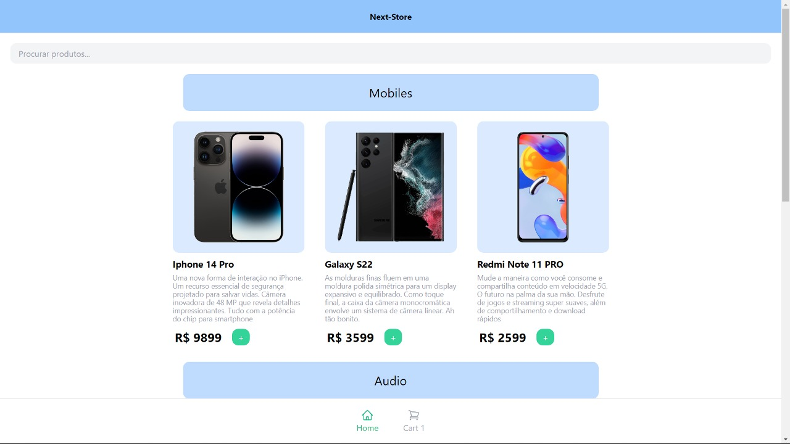

# Ecommerce

Este é um projeto de exemplo de um sistema de ecommerce desenvolvido em Next.js. Ele utiliza React, Next.js e Tailwind CSS para a construção da interface do usuário.
<a href="https://ecommerce-chi-bay.vercel.app/"> Confira Aqui</a>

 

## Funcionalidades

- Visualização de produtos
- Adição e Remoção de produtos ao carrinho
- Barra de Pesquisa
- Checkout de pagamento

## Pré-requisitos

Antes de executar o projeto, certifique-se de ter as seguintes ferramentas instaladas em seu ambiente de desenvolvimento:

- Node.js (v12 ou superior)

## Instalação

1. Faça um clone deste repositório para o seu ambiente local.
2. Navegue até o diretório raiz do projeto.
3. Execute o seguinte comando para instalar as dependências do projeto:
```
npm install
```

## Execução

Após concluir a instalação, você pode iniciar o servidor de desenvolvimento executando o seguinte comando:
```
npm run dev
```

O servidor será iniciado na porta `3000`. Acesse `http://localhost:3000` no seu navegador para visualizar o projeto.

## Estrutura do Projeto

A estrutura do projeto segue o padrão comum do Next.js:

- `pages/` - Contém as páginas do projeto.
- `components/` - Contém os componentes reutilizáveis.
- `styles/` - Contém os arquivos de estilo do projeto.

## Contribuição

Sinta-se à vontade para contribuir para o projeto fazendo um fork e enviando pull requests. Ficarei feliz em revisar e mesclar as alterações.
